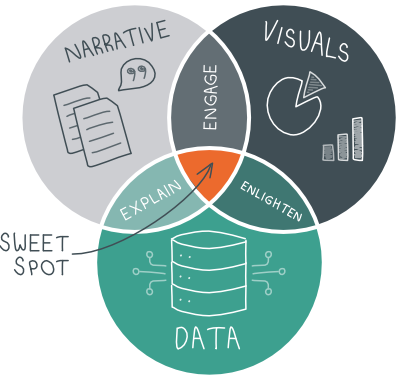

# portfolio
This is my public portfolio for Telling Stories with Data at CMU

# About me

Hi! My name is Edvin William Handoko (He/His/Him). You can call me Edvin. I'm a Master of Information Systems Management student at Heinz College, Carnegie Mellon University. Prior entering graduate school, I was a Tech Consultant in Singapore, working with various government agencies to solve their problem with digital solutions. My interest in Public Tech drives me to pursue higher degree.

I come from one of the biggest countries in Southeast Asia named Indonesia. If you know about Bali, Indonesia is the country where it is located. You should put my country as one of your travel bucket list! Besides Bali, you will find more tourism sites from natural to cultural. As the "Equatorial Emerald", you will taste the "paradise" while you're staying in Indonesia.

As I finish my program, I plan to go back to Indonesia and work in the Public Interest Tech sector. Indonesia has developed their digital economy significantly and started to build their government digital team in various strategic sector, such as healthcare, education and human capital. I think it's a good opportunity to be part of this initiative so that we can accelarate the progress more. 

# What I hope to learn

Data will be my good friend for my future career as I plan to work as a Product Manager/Tech Consultant. Since my role will relate closely with the user and stakeholder, having a seasoned skill in visualizing the data will be a significant skill for me. Furthermore, bringing the accurate yet compelling stories out of the data will help me to nail my work in every process. Hence, I really hope this course can help to equip my visualization and storytelling skills. Some practical theory in visualization such as color, layout or typography combined with narrative ability as stated in the course introduction will enhance my ability to contextualize the data with the user.

# Portfolio
Here's where all my cool work will go. You should hire me!
## Sketching Exercises
### Controlling Color
### Crafting for Clarity
### Choosing Chart Types
### Practicing Persuasion
## Data Visualization Critiques 1
## Data Visualization Critiques 2
## Data Visualization Assignment 1
## Data Visualization Assignment 2
## Final Project
